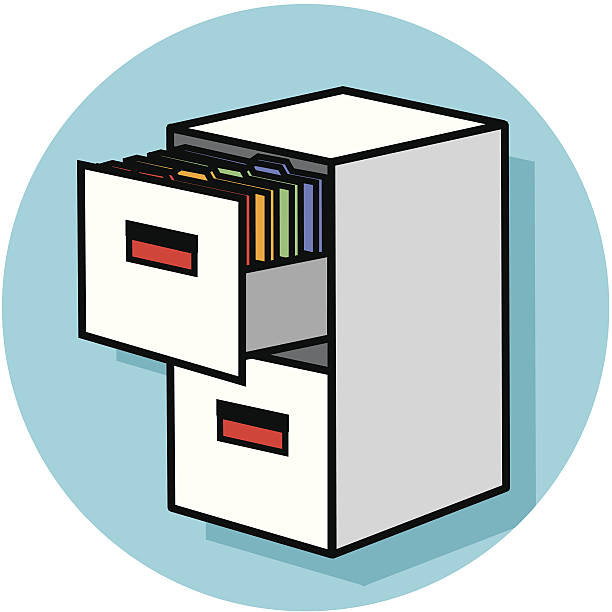

# Background Computer Info

## Introduction

Back in the day, anyone using a computer had to know the ins and outs of the file system and to some extent the command line, along with a few troubleshooting skills. Now, operating systems have improved to the point where that's no longer true. Along the way, common pieces of software have adopted a different set of UI (User Interface) design principles (very roughly, these are called "**mobile first**" design practices); on the other hand, more specialized software (both for programming and other courses you may take in college) has typically stuck with an older UI format, known as a **menu-based** UI (in more advanced courses, you'll get to see an even older UI format, command-line-based UIs).These design practices are **surprisingly different** in terms of how users are expected to interact with them. In this course, you'll be learning how to work with menu-based UIs, as the tools that we'll be using are primarily built this way.

## Quick Tip: Customize Your Mouse

Common terms to refer to mouse-based interactions (vs touch-screen interactions) are "click" and "right click" (or sometimes "left click" and "right click"). What you, specifically, actually do to trigger a right click depends on your computer's hardware and operating system, but it's also customizable. Common options: an actual right-click button, click the right half/bottom right corner of the touch pad, Command key \+ click, or two-finger click. You should set up your computer to use something that you find intuitive and easy (usually configurable under your operating system's settings).

## Error Messages

Many people ignore error messages \- ‘just click a button to make the dialogue box go away’ works reasonably well most of the time. However, starting in this class (and likely continuing on in your other classes, regardless of your major), you’ll be interacting with software where you’re expected to **fix** the cause of the error message \- that requires reading the message to know what you need to do.

Error messages that you’ve seen up to this point likely fell into two categories: **confirmation dialogues** for something you were already trying to do (‘Are you sure you want to exit?’), or messages that gave you **no useful information** (‘Something went wrong. Please try again later.’). There’s not a lot of point in reading those messages, so people get conditioned to ignore them (there’s actual psychological research about this, it’s called **error fatigue**). The error messages you’ll receive as you write a program are different \- they’re often informative, but even when they’re not, you still have to **find and fix** the underlying problem. Use the messages to get as much of a head start on this process as you can.

When an error message pops up, first: **read** the message. Next, ask yourself what the **immediate problem** is that’s causing this message \- usually, that’s written in the error message itself. As an example, a common pop-up message that you’ll get in Eclipse says roughly ‘There are compile errors in this project. Are you sure you want to run this code?’. Here, the immediate problem is: there are compile errors in the project. Once you know what the immediate problem is, you can **take steps to fix it** \- in this case, find and fix the compile errors so that there are no longer compile errors in the project. 

Some error messages won't pop up \- they'll sit quietly and wait for you to notice them, calmly wreaking havoc on your program in the meantime. Get in the habit of monitoring the **Problems tab** in Eclipse, and noticing anything that seems "weird" even if it's not immediately clear if anything is broken.

As part of this class, you’ll be working with a number of new and unfamiliar systems \- part of the learning objectives for the course are developing the **problem solving and troubleshooting** skills to successfully work with new pieces of software. If you run into an error, the expectation is that you will try to **solve it on your own first** before asking for help \- you’ll notice that one of the first questions that you’ll get asked if you get stuck is ‘what have you tried?’. You can still ask for help, of course\! Troubleshooting is a skill that you’ll be developing, so you aren’t expected to be perfect at it every time. As a rough guideline: if you've spent 30 minutes trying to troubleshoot an error, and haven't made any progress, **ask for help.**

## File Systems

The file system on your computer stores any data that doesn't go away when you restart the computer (this applies to your phone/tablet as well, not just laptops). It's modeled after a filing cabinet \- there's the outer cabinet (called the **'root'**), and within the cabinet, there are **folders**. Those folders might contain individual pieces of paper (**files**), or even more folders (called **sub-folders**, or **nested** folders).   

The full list of folders to get to a file is called its **path**. For example "Start with the 'Lecture Hall' folder, find the 'Science Hall' subfolder, and then look at the SH 181 file" would be a set of directions to find a file in a real filing cabinet. On a computer, the path might look like "C:\\Lecture Hall\\Science Hall\\SH 181.txt". There's also a shorthand version of a path (called a **relative path**) that starts at whatever folder you're currently looking at, and navigates from there. So if you had just been looking in the Science Hall folder, and asked "Hey, where's the file for Science Hall 260?", the answer might be 'That's the one called SH 260'; in computer terms, you could just open file "SH 260.txt" if you were already in the Science Hall folder.

How can you **access** a folder? On a Mac, use **Finder**; on Windows, use **File Explorer**. Both of these will have "shortcuts" along the left-hand side to get to commonly-used folders (such as 'Downloads' or 'Documents').

How can you find out **where a file is**? Every file in every program is stored somewhere on the file system. Sometimes, those files aren't very useful outside of a particular program (a saved game for Minecraft, for example) \- in those cases, programs tend to hide exactly where they're storing that data. Other files are more general purpose \- they can be opened by many programs or people (ex: a Word document or a PDF). For these files, you can usually find their location under File \> Properties or a similar menu (depending on the program). You can also search for files by name in Finder/File Explorer

On a mobile device, the file system still exists, but is often hidden \- the best way to get to your files is usually through a program. Fun experiment: see if you can find where the photos from your phone camera are stored on your phone's file system.

## How Does This Apply to CS1?

The programs you create will be saved in .java files on your computer; these files are text files that you can open in not just Eclipse, but any text editor (Notepad, Word, etc). Typically, for an assignment, you'll want to know:

- What is the path to your java files  
- What is the path to your assignment 'repository' (the folder Github Desktop created)  
- How to find files or folders that you've downloaded, and how to move them to another folder
