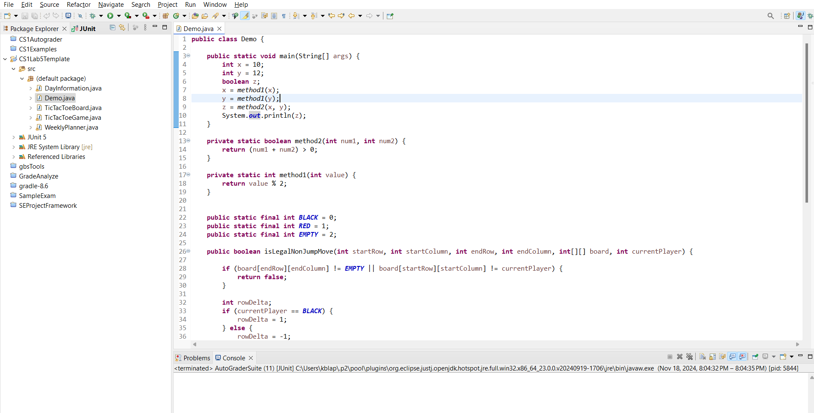
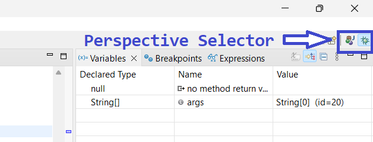

Get to Know Eclipse

Introduction

Eclipse is a professional-grade piece of software \- it's commonly used by developers at major companies to write Java code. This means there are a **lot** of features, settings, bells and whistles. We won't be using all of these this semester (although feel free to poke around\!) \- each assignment will have relevant settings pre-configured for CS1. There are several very handy features that you'll want to be familiar with, though\!

Workspace and Projects

A **workspace** in Eclipse is a collection of general settings \- as part of the first lab, you'll be downloading a pre-configured workspace for this class, which will include some handy key shortcuts as well as customized visual components.  Typically, there are also several **projects** \- these are a group of .java files with the code for a particular program or set of related programs. For CS1, each week's assignment will be a new project within the workspace; the workspace itself will stay the same all semester.

Java Perspective

Within a given workspace, there are several **perspectives** \- this is a visual layout optimized for a particular task. As you move through the various phases of building your programs, you'll switch from one perspective to another to have easy access to the right tools at the right time. The **Java perspective** is optimized for **writing** code. It looks like this:  

**Main Area**

Since this perspective is designed for writing code, the bulk of the screen is taken up by the text editor \- if you open a .java file, it will display here, and let you write and edit your code.

Eclipse does not automatically save files \- in order to compile them or run them, you have to save your changes. An asterisk (\*) will show up next to file names that have unsaved changes. Get in the habit of frequently saving your files (after every few lines of code) \- the Ctrl-S shortcut is helpful here (see 'Keyboard shortcuts' at the end of this handout for more info).

**Left-hand side tabs:**  
*Package explorer* \- lists the files and folders for your project. Includes .java files, text/image/resource files, open and closed projects, and code dependencies. You'll use this view to run the Checklist (expanding 'Referenced Libraries'), and to find your code (under 'src').

To open a file in the main text editing area, double-click it in the Package Explorer \- if you make changes to the folders or files from outside Eclipse, you can right-click on the top level folder for the project and select 'Refresh' from the list to force Eclipse to sync with the File System.

*JUnit* \- lists recently run tests; this is where you'll see the results from running the Checklist. 

**Note About the Checklist:** as you've probably guessed from how built-in the Checklist seems to be, the Checklist is not just a CS1 concept \- the more formal name is a **JUnit Test Suite**, and it's something that you'll find in any medium-to-large coding project, whether that's at a software company, an open source project, or someone's personal project. In more advanced courses, you'll be expected to create your own checklists, but for CS1 they're provided for you. The requirement that **all the tests** (aka checklist items) **pass** (aka have a green checkmark) is usually stricter than in this course; in most classes/codebases, you wouldn't be allowed to submit code that didn't pass all the tests. Since CS1 is an introductory course, you can still get partial credit for assignments that don't check off every item on the checklist.

**Bottom-right tabs:**  
*Problems* **\-** this view will show you any **compile errors** or **warnings** in your code. If you see a red squiggle in your code, check the Problems tab for details about what's causing that.

*Console* **\-** this is where many programs will print their output; if your program **crashes**, it will print details here.

Debug Perspective

This perspective is designed for **fixing issues** with your code after you've written it \- for professionals, most of their time (\~70%) is spent debugging, which is why there's an entire perspective devoted to this. In this perspective, the actual text window is smaller, and there are some extra windows to provide context about what's going on with your code **while it's running.**

**Left-hand side tabs:**

In addition to Package Explorer and JUnit, there's a new view called Debug

*Debug* \- This view shows details about what program(s) are running. It's a good idea to only run one program at a time, so if you have multiple that show up in this view, you can stop the extra ones by selecting them and then hitting the red square Stop button on the top toolbar ribbon. If you run a program in Debug mode, and hit a **breakpoint** (more on that in the 'Breakpoints' section), this view will also tell you what line the program is currently stopped at. Later in the semester, when we talk about methods, we'll revisit this view, because it can actually give you a lot more information than just what line you're on.

**Right-hand side tabs:**

*Breakpoints* \- A **breakpoint** in code is a point (line of code) where program execution **takes a break** (pauses). You can set these by double-clicking to the left of a line number for an **executable** line of code, and then if you run your program in debug mode, the program will pause at that line and let you see what's going on. This is very useful when your program isn't doing exactly what you want \- you're essentially telling the computer 'ok, walk me through what you're doing step-by-step, and we'll figure out what's going wrong'. The Breakpoints view shows you every breakpoint that you've set up, and whether or not it's currently enabled. 

*Variables \-* This view tells you what the state of **computer memory** is in your program. Variables store data related to your program, and as the name suggests, the data can **vary** over time (this is different from variables in math, which typically have an unknown-but-fixed value). When your program pauses at a **breakpoint**, the Variables view will tell you all the values that are stored in memory at that point in the program.

*Expressions \-* This view lets you run **ad-hoc experiments** on your code. This is the 'Oh, hold on, try tightening that screw/unplugging that cord and moving it to a different outlet/twisting the door knob the other way' part of figuring out where a problem is. You can add an **expression**, which is a single line of code, and the computer will run that and tell you what happened.

Switching Perspectives

Usually, after being in the debug perspective for a while, you'll find a problem with the program and then need to go fix it. Switching back to the Java perspective can be helpful if you're back to writing code rather than running it, which you can do by clicking the relevant small icon in the upper right:  

Keyboard Shortcuts

Switching from mouse to keyboard is slow and gets old real fast. Some keyboard shortcuts that can help:

**Widely supported across most programs:**

Ctrl+S (Cmd \+ S on Mac) \= save, for programs that don't have save-on-keystroke  
Ctrl+C \= copy  
Ctrl+X \= cut  
Ctrl+V \= paste  
Ctrl+Z \= undo

**Eclipse specific commands:**

Ctrl+K \= cut entire line	(technically, this is an emacs-specific command. It's useful enough that I've pre-loaded it into Eclipse for everyone)  
Ctrl+/ \= comment out entire selection  
Ctrl+i \= format entire selection