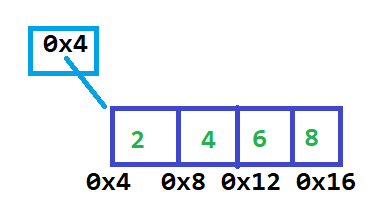

# Arrays

## Introduction

We’ve already seen ArrayList as a class, now we’re going to see the ‘array’ part of that name. Arrays are an important building block that exist in most programming languages (often with fairly similar syntax), although they’re less common to use directly in code in practice. Knowing how they work can give you more insight into how other aspects of a programming language work, so they’re useful background information to have.

## Array vs ArrayList

An ArrayList is **variable-length** \- you can keep adding to it however many times you want, and you can use size() to find out how many things you’ve added to the list. An array, on the other hand, is **fixed-length** \- once you create one, you can never change its size. In that way, an array is very like the real world; if you buy a bookcase with 3 shelves, and you decide you want a 4th shelf, you have to go get a new, larger bookcase and move all your existing books over to the new bookcase.

As you can imagine, an ArrayList is a good fit for situations where you **don’t know the number of elements** ahead of time \- anything where you’d populate the list with a `while` loop lends itself well to an ArrayList. For example, reading from a file or user input and saving that information in a list is an excellent use for an ArrayList.

An array works well for situations where there are a **fixed number of “spaces”** for elements, and having an empty space is either meaningful for the program (a Bookcase class with a Shelf array might have an empty Shelf), or indicates a bug (an EventBooth that requires a specific number of volunteers staffing it at all times should never have too few volunteers). One important note is that while an array has a fixed size once it’s created, that size can be specified by a variable. For example, a Bookcase class could allow a program to create one Bookcase with 3 shelves, and another with 5 shelves \- once created, the number of shelves can’t change, but an array allows both 3 and 5 shelf bookcases to use the same object type.

## Array Syntax

Array syntax is a holdover from older programming languages, so it looks fairly different from anything we’ve seen so far. The good news is that arrays always use square brackets (\[ \]), and nothing else in Java uses square brackets, so a good rule of thumb:

\[ \] means array, array means \[ \]

Pronunciation note: computer science and mathematics have a lot of overlap, and the idea of arrays started with math, where subscript notation is easy to use. For example “a sub 1” would be written a<sub>1</sub>, with “sub” for “subscript”. Programs, however, are written in monospaced ascii only plaintext, so subscripts aren’t supported. Instead, programmers use \[ \], but keep the same pronunciation. As a result, a\[1\] in a program is pronounced “a sub 1”, and int\[\] arr is pronounced “int array arr”.

**Creating an array:**

```
__________________[] ___________________ = new ______________________[_______________________];  
(Type of element)       (variable name)        (same type of element)   (number of elements)
```

For example:  
```
// creates an array of 5 integers called intArray  
int[] intArray = new int[5]; 

// creates an array of 3 Shelf objects  
Shelf[] bookShelves = new Shelf[3]; 
```

Note the lack of parentheses\! This looks pretty different from constructors; if you’re already familiar with arrays from other languages, this may look fairly intuitive, but if not, this is a good template to add to your notes.

**Accessing an element:**

```
________________[____________________]  
(variable name)     (specific index)
```

This can be used anywhere a variable name could be used \- left or right hand side of an \=, as a parameter, or as something to call a method on. For example:

```
int[] intArray = new int[5];  
intArray[0] = 5; // The 0th element now stores ‘5’  
intArray[1] = intArray[0]; // now both the 0th and 1st elements are set to 5  
System.out.println(intArray[1]); // prints ‘5’

Shelf[] bookShelves = new Shelf[3];  
bookShelves[0] = new Shelf(); // initializes the 0th element

// assuming ‘addBook’ is a method on Shelf, calls the method on the newly-created Shelf  
bookShelves[0].addBook(); 
```

**Checking the Length:**

Where String has the length() method, and ArrayList has the size() method, arrays have a length **instance variable**. Accessing an instance variable is much like accessing a method, just without the parentheses:

```
int[] intArray = new int[5];  
System.out.println(intArray.length); // prints '5'
```

You'll notice in this example that the length is 5 even though nothing has been initialized yet \- the length of the array is the number of spaces available, regardless of whether the space contains data yet.

## Important difference between arrays and ArrayList: accessing the actual pointer

ArrayList’s `get` method returns a **copy** of a pointer \- while you can use that on the right hand side of an assignment, or call methods on it, you can’t use it to change the actual pointer stored in the ArrayList. Trying to use `get` on the **left hand** side of an assignment operator won’t compile:

```
ArrayList<String> example = new ArrayList<>();  
// won’t compile\!  
example.get(0) = “hello”; 

// similar, but also not helpful, since it doesn’t change the ArrayList  
String value = example.get(0);  
value = “hello”;
```

Usually, the `add` method on ArrayList is the only one you need for putting data into a list, but if you needed to update an existing pointer, you’d use a method called `set` (which we haven’t covered, but you can probably guess what `set(int index, E element)` does; you won't need this method for anything in this course, however).

On the other hand, arrays give you **direct access to the pointer** \- you can update the values stored in the array by assigning a new value to the actual index in the array. This, like a table saw, is both powerful and dangerous \- make sure to pay close attention to what code is updating an array.

## Initializing elements

Creating an array just creates the **array**, it doesn’t store any elements into the array to start. Always initialize all the elements after creating an array; just as not initializing an instance variable in a constructor can cause a NullPointerException later on, not initializing the elements in the array can also cause a NullPointerException if the array stores object types.

After creating an array, it's typical to use a **for loop** to initialize the elements. Conveniently, the loop variable and the array index both count from 0 to the length of the array, so you can use the same variable for both:

```
int[] arrayOfEvens = new int[5]; // create an array that can store 5 integers  
for (int arrayIndex = 0; arrayIndex < arrayOfEvens.length; arrayIndex++) {  
  int evenNumber = arrayIndex * 2;  
  arrayOfEvens[arrayIndex] = evenNumber;  
}
```

## Printing arrays

Unlike ArrayList, which has a nice toString() method on the ArrayList class, arrays do not have one built in. If you call System.out.println on an array type, you’ll get an unhelpful hex value. To get the contents of the array instead, use the static method from the Arrays class (note the plural \- Arrays, not Array), `Arrays.toString`. This method is overloaded to accept any type of array. For example:

```
int[] intArray = new int[5];  
System.out.println(intArray); // prints useless nonsense  
System.out.println(Arrays.toString(intArray)); // prints the array contents
```

## Arrays and Memory, or Why Everything Starts From 0

If you've ever wondered why everything in CS starts counting from 0, it's because of arrays. In memory, an array is a **contiguous block** \- each element is at the memory address right after the one before it. This isn't generally true of objects in memory \- generally, they can be created anywhere in the memory for a program. Arrays are contiguous not just in Java, but in all programming languages. Long ago (ah, the 80s, ancient history), it wasn't unusual for programmers to have to manage their pointers by hand \- if you want to see someone shudder, ask someone who's written a lot of code in C about "void stars" (written void\*). For an array, the pointer stores the memory address of the **first** element in the array:



(Addresses given in decimal despite the hex notation for readability). 

To get the memory address of a particular element, you count how many elements to skip past to get to it, multiply by the size of an element, and add that to the pointer. For example, to get the address of the '4' value, we start at memory address 0x4, skip past 1 4-byte int, and end up at 0x4 \+ 1\*4 \= 0x8 as the memory address. Under the hood, this is what array indexing still does, which is why, to get the first element in the array, you use 0 \- there aren't any elements to "skip past", so the address is 0x4 \+ 0\*4 \= 0x4. Similarly, the last index is at the length \- 1 index, since you'll skip past all but one of the elements to get to the last one.

As we saw when initializing the array, it's convenient to have the loop bounds and the array index bounds match up, which is how having loops start at 0 began as well.

## Array Example


Let's look at an example class that uses an array: a ShoeRack class that can hold a fixed number of shoes. A given ShoeRack might hold 3, 5, 7 or any other number of shoes, but once it's been created, that number is fixed \- to get more space for shoes, you'd need to create another shoe rack. For our purposes (and to get a little more practice with classes), we'll also create a Shoe class that has an integer size and a String for the model.

```
public class Shoe {  
   private int size;  
   private String model;  
}
```

To start, the class just has the instance variables declared, but we'll also want to create a constructor to initialize the instance variables:

```
public class Shoe {
   private int size;
   private String model;
  
   public Shoe(int size, String model) {
       this.size = size;
       this.model = model;
   }
}
```

Next, we'll create the actual ShoeRack class. Since a ShoeRack should have some fixed number of spaces for shoes, we'll want an instance variable for that, which will be an array. The type of thing stored in the array is Shoe, which will show up in the type for the instance variable:

```
public class ShoeRack {
   private Shoe[] shoeSpaces;
}
```

To create a ShoeRack, we'll need to know how many spaces it should have. For now, we'll say a space with no shoe in it will be null \- while this is the default value, for clarity, we'll initialize every value to null (relying on a default makes code harder to debug, since there are more unwritten semantics to remember \- there's no need to add even more "things to remember" to that process).

The parameters to the constructor are "what we need to know" to create the object \- for a ShoeRack, that's the **number of spaces** to create:

```
public class ShoeRack {
   private Shoe[] shoeSpaces;


   public ShoeRack(int numSpaces) {
       this.shoeSpaces = new Shoe[numSpaces];
      
       // TODO: initialize the spaces to null (for clarity)
   }
  
}
```

Now, we'll add a loop to initialize the elements in the array:

```
public class ShoeRack {
   private Shoe[] shoeSpaces;


   public ShoeRack(int numSpaces) {
       this.shoeSpaces = new Shoe[numSpaces];
      
       // Be explicit about representing an empty space with null
       for (int arrayIndex = 0; arrayIndex < shoeSpaces.length; arrayIndex++) {
           shoeSpaces[arrayIndex] = null;
       }
   }
  
}
```

Now, we need a way to add a Shoe to the ShoeRack, if we can. A common pattern for methods like this is to return a true/false value to indicate the "if we can" aspect \- since there isn't anything else we need to return, there's no need to create a sentinel value:

```
// Adds a shoe to the shoe rack if possible.   
// If the shoe was added, returns true, otherwise, returns false  
public boolean addShoe(Shoe toAdd)
```

To fill in the method, first clarify what we're going to do:

```
   public boolean addShoe(Shoe toAdd) {  
       // find an empty slot  
       // if we find one, add the shoe there and return true  
       // if we don't, return false  
   }
```

To find an empty slot, we'll consider each element of the array in turn:  
```
   public boolean addShoe(Shoe toAdd) {
       // find an empty slot
       for (int arrayIndex = 0; arrayIndex < shoeSpaces.length; arrayIndex++) {
           // if the space is empty, add the shoe and return true
       }
       // if we get to here, we didn't find a space!
   }
```

Notice that we can refer to shoeSpaces without any additional declaration, because it's an **instance variable** \- all ShoeRacks have a shoeSpaces. Since addShoe is not static, there's some particular ShoeRack that we're trying to add the shoe to, and that's whose shoeSpaces we're using. If you ctrl+click on an instance variable like this in Eclipse, it will take you to the **instance variable declaration**, so you can double check what type is involved.

Now, we need to check if a space is empty \- in the constructor, we decided that an empty space was represented by null, so that's what we'll check for:

```
   public boolean addShoe(Shoe toAdd) {
       // find an empty slot
       for (int arrayIndex = 0; arrayIndex < shoeSpaces.length; arrayIndex++) {
           // if the space is empty, add the shoe and return true
           if (shoeSpaces[arrayIndex] == null) {
               shoeSpaces[arrayIndex] = toAdd;
               return true;
           }
       }
       // if we get to here, we didn't find a space!
       return false;
   }
```

Now ShoeRack looks like:

```
public class ShoeRack {
   private Shoe[] shoeSpaces;
   public ShoeRack(int numSpaces) {
       this.shoeSpaces = new Shoe[numSpaces];
      
       // Be explicit about representing an empty space with null
       for (int arrayIndex = 0; arrayIndex < shoeSpaces.length; arrayIndex++) {
           shoeSpaces[arrayIndex] = null;
       }
   }
  
   public boolean addShoe(Shoe toAdd) {
       // find an empty slot
       for (int arrayIndex = 0; arrayIndex < shoeSpaces.length; arrayIndex++) {
           // if the space is empty, add the shoe and return true
           if (shoeSpaces[arrayIndex] == null) {
               shoeSpaces[arrayIndex] = toAdd;
               return true;
           }
       }
       // if we get to here, we didn't find a space!
       return false;
   }
  
}
```

And we could build a small program to test it:

 ```
   public static void main(String[] args) {
       ShoeRack manyShoes = new ShoeRack(10);
       ShoeRack fewShoes = new ShoeRack(2);
      
       // add 11 pairs of shoes, all alike
       for (int i = 0; i < 11; i++) {
           int size = 9;
           Shoe exampleShoe = new Shoe(size, "Sneakers");
           if (fewShoes.addShoe(exampleShoe) == false) {
               manyShoes.addShoe(exampleShoe);
           }
       }
   }
```
```
