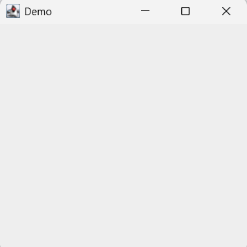
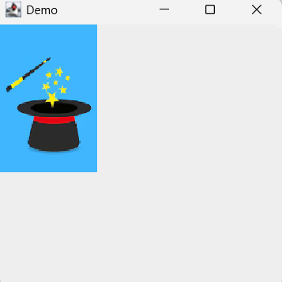
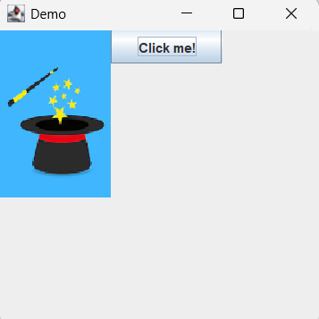
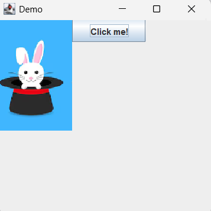

# Graphics Frameworks

## Introduction

Computer graphics are an entire field by themselves, with a large number of frameworks and approaches. We're going to be using a very simplified framework to get a sense for the basics. The code we'll be using is based off something called Java Swing, but we're going to focus on the more universal aspects that any graphics framework will include. Swing itself is neither particularly modern nor user-friendly, but it does lend itself nicely to being simplified.

## Components

The first part of creating graphics for a program is to decide on the pieces, or **components**, of the visual and interactive parts of the program. This might be something as simple as "a red circle", or as complex as "an auto-scrolling image gallery". Each component should be able to function independently of other components - a red circle doesn't need to know if there's also an image gallery on the screen. Much like instance variables in classes allow you to nest one class within another, it's possible to nest smaller components within larger components to build more complex visuals.

We'll be using a couple simplified components for this course, all of which have names that start with 'CS1' - if you need to list them, ctrl+shift+T in Eclipse will let you search for 'CS1' as a prefix.

## Layout

Once you have several components, the next part of creating graphics is deciding how the components will **be laid out on the screen**. For example, if you have a red circle and an image gallery, does the circle go on the left of the gallery, or above/below/to the right? Perhaps you want to add an animation so that one component moves across another! The **layout** for the graphics determines where each component goes in relation to all the others.

We'll be using an extremely simplified version where you specify the location of a component on the screen in (x,y) coordinates in terms of pixels. This is fairly easy to work with for learning purposes, but not actually a good idea for any real world program: since everyone uses a different computer with different screen sizes and resolutions, specifying locations in terms of absolute pixels tends to work poorly for programs that need to run on phones, tablets, overhead projectors, laptops, and desktop monitors. More commonly, a layout manager will allow you to specify fractional positions and relative sizes of components - if you take any additional graphics courses, you'll get to see these types of layouts.

To specify the layout of a component, we'll use a method that's defined on all the components:

`setBounds(int x, int y, int width, int height)`

This method specifies the (x,y) of the upper left of the component, along with the width and height, all of which are measured in pixels.

## Action Listeners

Most programs that have graphics have some way for users to interact with the graphics - clicking on an icon, entering text into a field, dragging items around the screen, etc. Adding this logic to your program involves a new programming concept: an **action listener**. Action listeners are implemented in different ways in different programming languages - in Java, they use something called "anonymous inner classes" (or, frequently, "lambdas"). You'll see more details on exactly what that is and how it works in CS2, but for now, we're going to focus on what an action listener does (rather than how it does it). An action listener provides a **hook** into your code that allows the **peripherals** for your device to alert you to what a user has done. A **peripheral** is a general term for something external to your computer that can interact with the world - a mouse, keyboard, touch screen, or webcam are all examples of peripherals. Common action listeners are set up to get information about when a user types on a keyboard, or moves or clicks the mouse.

The action listener specifies two things:

- What **event** it's listening for (a mouse click, for example)
- What **code should run** (ie, what action to take) when the event happens

**Syntax**

We'll be using **lambda syntax** to specify the code to run - it looks a bit unusual, but minimizes the amount of extra syntax surrounding your code:

```
____________________________.addMouseClickLogic(() -> {
(name of component variable)
      _________________________________;
      (what code should run when the mouse click takes place; can be multiple lines of code)
});
```

For our purposes, we'll specify the event type by calling a specific method, usually 'addMouseClickLogic'. Later in the semester we might introduce an 'addTextBoxSubmitLogic' or similar.

## Specific Classes

Methods that work for any **component** (any of the following except CS1Frame):

`public void setBounds(int x, int y, int width, int height)` - determines where the component will display in the frame. The component's upper left corner will be at (x,y) with the specified width and height

`public void setForeground(Color color)` - an unfortunately named method, this will set the color of any **text** on the component. 

`public void setBackground(Color color)` - this method makes the 'foreground' naming make more sense, it sets the background behind any text

**CS1Label**

Creates text on the screen

`public CS1Label(String text)` - creates a label with the specified text

`public void setText(String newText)` - updates the text for the label

**CS1Button**

Creates a clickable button

`public CS1Button(String text)` - creates a button with the specified text

`public void setText(String newText)` - updates the text for the button

`public void addMouseClickLogic(MouseClick code)` - allows you to specify what code to run when the button is pressed

**CS1Image**

Displays an image file

`public CS1Image(String filePath)` - accepts the name or relative path to an image **in the resources folder of the project**

`public void setImage(String newPath)` - updates the image to the contents of the new file

**CS1UserInput**

`public String getUserInput()` - prompts the user for text input and returns it

**CS1Frame**

`public void add(Component c)` - adds any component (such as a CS1Image or CS1Label) to the program's visible frame

`public void setVisible()` - call this after adding all the components to get the program to actually display

## Example Program

Let's consider the following program that pulls a rabbit out of a hat.

```
public class SampleProgram {

    public static void main(String[] args) {
        // Create an outer frame for the program
        CS1Frame frame = new CS1Frame("Demo", 300, 300);
        
        // TODO: rabbit magic
        
        // Once everything's set up, remember to make it visible!
        frame.setVisible();
    }
}
```

The first thing that the program does is create an outer **frame** that will contain all the components. The `setVisible` method will handle drawing all the initial components, so you should only call it once all the components have been added to the frame. Right now, we haven't added any components, so the program looks pretty boring:



Now, let's add an initial image of an empty magic hat:


```
public class SampleProgram {

    public static void main(String[] args) {
        // Create an outer frame for the program
        CS1Frame frame = new CS1Frame("Demo", 300, 300);

        // Add an initial image
        CS1Image image = new CS1Image("magicHatEmpty.png");
        image.setBounds(0, 0, 100, 150);
        frame.add(image);
        
        // TODO: rabbit magic
        
        // Once everything's set up, remember to make it visible!
        frame.setVisible();
    }
}
```

Here, we create the **image component** and give it the initial image to display. Next, we specify a size and location: 100 pixels wide, 150 pixels tall, and with an upper left corner that's 0 pixels down and 0 pixels over from the upper left of the frame. Finally, we add the component. Choosing the right pixel settings is often a matter of trial and error - choose something plausible, run the program, see if it looks good, and if not, adjust the values. Now we have a hat, but no bunny:



We want the bunny to appear when the user clicks a button, so let's add a button to handle the magic:

```
public class SampleProgram {

    public static void main(String[] args) {
        // Create an outer frame for the program
        CS1Frame frame = new CS1Frame("Demo", 300, 300);
        
        // Add an initial image
        CS1Image image = new CS1Image("magicHatEmpty.png");
        image.setBounds(0, 0, 100, 150);
        frame.add(image);
        
        // Add a button
        CS1Button button = new CS1Button("Click me!");
        button.setBounds(100, 0, 100, 30);
        frame.add(button);
        
        // Once everything's set up, remember to make it visible!
        frame.setVisible();
    }
}
```

Much like with the image, we create a component, set its bounds, and add it to the frame. This button will still be at the top of the screen, but 100 pixels over from the top left, which should put it right next to the hat:



For the final part of the trick, we want the image to change when the user clicks the button, which requires an action listener:

```
public class SampleProgram {

    public static void main(String[] args) {
        // Create an outer frame for the program
        CS1Frame frame = new CS1Frame("Demo", 300, 300);
        
        // Add an initial image
        CS1Image image = new CS1Image("magicHatEmpty.png");
        image.setBounds(0, 0, 100, 150);
        frame.add(image);
        
        // Add a button
        CS1Button button = new CS1Button("Click me!");
        button.setBounds(100, 0, 100, 30);
        frame.add(button);
        
        // Add an Action Listener: when the button is pressed,
        // run the code in the inner curly braces
        button.addMouseClickLogic(e -> {
            // any code in here runs whenever the button is pressed
            image.setImage("magicHatBunny.png");
        });
        
        // Once everything's set up, remember to make it visible!
        frame.setVisible();
    }
}
```

When the user takes an action with the button, the code we provide will run. For buttons, this is simple - the only action that buttons support is being clicked. With more complex action listeners, you may have to check what event actually happened - that information is stored in the variable `e`. In this case, though, we can just say that any click of the button should change the image to the bunny.

Now, after the user clicks the button, they'll see:



Feel free to try this yourself! Copy the above code into Eclipse, and download the two png files from the images/ folder on the left into a folder called `resources` in your Eclipse project, and give it a whirl.
