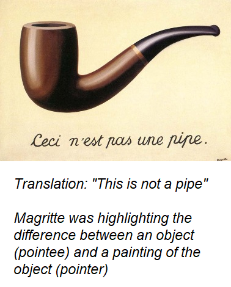
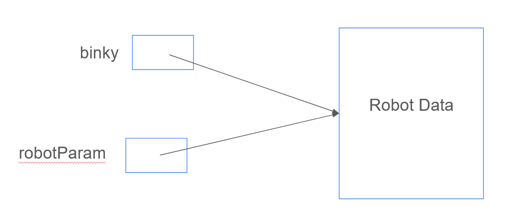
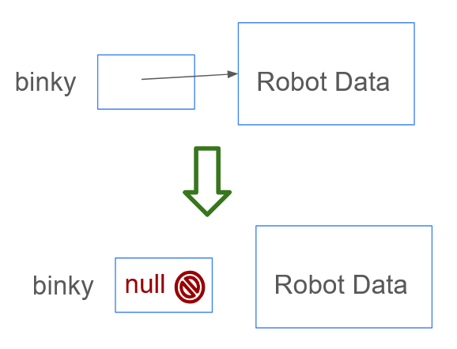
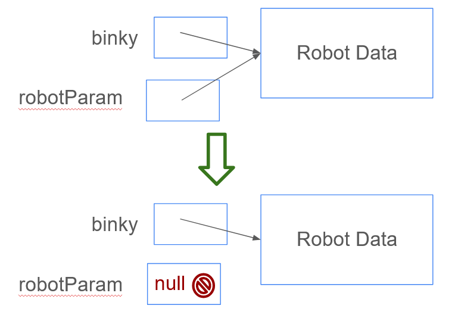
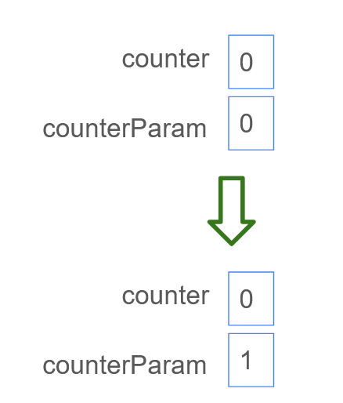

# Introduction

As we get to more complex programs, it’s important to be precise about what’s actually happening with computer 
memory. Specifically, it's important to track what changes to data are visible when, and when changing data is **permanent** vs **temporary** - for example, some data changes are only visible within a method, while some persist outside of a method. 
 
## Practical Applications of Literary Theory



There's a surprising connection between early 19th century literary theory and how programs manipulate computer memory. If you're familiar with Deconstruction as a literary technique, pointers will make a lot of sense (the pointer is the signifier, the object in memory is the signified). If you aren't, don't worry! The good news is that if you do take a literature class where this comes up, you'll have a big leg up there - Derrida is essentially talking about pointers.

They key concept with both pointers and Deconstruction is that the **name** for something is closely related to, but not identical to, the **thing itself**. If I write the word 'cat' on a whiteboard, that **refers to** a physical fluffy animal, but the whiteboard itself is not the actual cat. As a result, there can be many ways to refer to the same single object - for example, "Science Hall 247" and "Katherine's Office" are different names for the same physical space. Even though there are multiple names for the room, there's still only one such room. For any **object type** in a program, the name for the object is stored separately from the object itself in memory. Primitive types, on the other hand, do not have this separation, and as a result can behave quite differently from objects.

## How Do Pointers work

A **pointer** is a small piece of memory that stores a **memory address** for some larger piece of data. A memory address works much like a physical address - just as "1 Hawk Dr" is a short way to refer to where SUNY New Paltz is, 0x02345 is a short way to refer to a specific location on a disk in your computer. Just as a physical address lets you send data to a location (ex: write a physical letter), you can send data to a particular location in computer memory (write a byte or bytes). You can also look up the location - similar to how a Street View application will let you see what's at a physical address, you can ask your computer to tell you what's written at a particular memory address.

When you create an object-type variable, what actually happens is the computer sets up a small space to store an address, and associates the name you give to the variable with the address; this is called a **pointer**. This is similar to saving a favorite location with some name on a map ('Home', 'Work', 'School', etc). Just as you might have multiple people store the same location in their favorites, all with different names (a student might store 1 Hawk Dr as 'School', while a professor might store it as 'Work'), you can have multiple pointers, all with different names, that refer to the same address in memory.

So how do you set up the **actual memory**? That's the `new` keyword! Anytime you see `new`, it's reserving enough space for all of an object's data in memory, and returning the **address** where that space is located. If we want to analyze the line

`Robot binky = new Robot();`

The computer will do the following when it runs this code, in this order:

- Reserve enough space in memory for all the data associated with a Robot (we'll call this the **pointee**)
- Write down that address in a small space in memory (we'll call this the **pointer**)
- Associate the name 'binky' with the small space containing the **address** for the Robot

## Null Pointers

Data in memory has a default value of all-0 bits. What that represents depends on the data \- for an int or a double, that’s the value 0 (or 0.0). For a boolean, it’s the value false. For object type pointers, that’s a value called `null`, and trying to use it will throw an exception (specifically, a NullPointerException, or NPE for short). Usually, the compiler will keep you from accessing this default value by requiring that values be **initialized** before being used, but it’s not a perfect system; for example, you can actually initialize a pointer to `null`. If you have a pointer that is `null`, you can’t call any methods on it, including .equals \- this is one of the few cases where you’ll use \== or \!= with an object type. For example, if you wanted to check if Binky had been initialized, and if not, create a new Robot, you could write:

```
Robot binky = null;
// some other code happens
if (binky == null) {
  binky = new Robot();
}
```

## Can I have a Visual?

Yes\! If you would like to see pointers explained by a claymation Binky, watch this short video:  
[Binky Pointer Fun](https://www.youtube.com/watch?v=vm5MNP7pn5g) 

This video uses a made-up example class called IntObj that has an instance variable called value \- you can think of this class as existing to treat an int as an Object, for purposes of talking about pointers. After watching the video, see if you can figure out what the following code would do:

```
Robot binky = new Robot();  
Robot imposter = binky;  
binky.paintSquare(Color.RED);  
imposter.moveForward();  
System.out.println(binky.getSquareColor());
```

**Spoilers\!**

Because there’s only one call to `new` in the above code, there’s only one Robot in computer memory \- much like in the video where x and y pointed to the same pointee, imposter and binky refer to the same Robot pointee. So when the imposter moves forward a square, the Robot that binky refers to also moves forward a square, and is now standing on a default-colored white square.

For a more real-world analogy:

Imagine that Katherine has a pile of quizzes to hand back. Next, Professor Brainard hands back all of the quizzes. Now, Katherine has no quizzes to hand back, because there’s only one actual person in this situation \- there are just two pointers to that same person, so when “Professor Brainard” hands back quizzes, that affects the quizzes that “Katherine” has access to.

## Why Does This Matter

It's unusual to have two pointers in the same scope that point to the same object, so outside of tricky quiz questions, you won't usually encounter that situation. However, there is a very common situation where you'll have two pointers to the same data, and that's with **parameters**. When you pass a value to a method, what you're actually passing is a **copy** of the data. Changes to the copy won't affect the original back in the main method (or whatever calling context you're using). For primitive types, this is nice and simple, but for object types, it becomes trickier - what's being passed in is a copy of the **pointer**, but not a copy of the pointee. Any changes made to the pointee by calling methods on the object **will affect the original**, because there's only one actual object (just with two pointers). 

We've already seen this with Binky - when you pass Binky to a method, and have him move or turn, that affects the original (and only) Robot in the program. However, if you were to change the **pointer itself**, that would not change the original pointer.

**Examples**

<div>


```
public static void main(String[] args) {
  Robot binky = new Robot();
  moveForwardSafely(binky);
}

public static void moveForwardSafely(Robot robotParam) {
  if (robotParam.isClear()) {
    robotParam.moveForward();
  }
}
```
</div>

Here, you can see that both the main method and the moveForwardSafely method will affect the same Robot data - both pointers point to the same **object instance**. When moveForwardSafely moves robotParam forward one square, the Robot that binky refers to will also be moved forward one square, because they're the same Robot.

Now let's consider a slightly silly program. The second call to moveFoward here will crash with a NullPointerException:

```
public static void main(String[] args) {
  Robot binky = new Robot();
  binky.moveForward();
  binky = null;
  binky.moveForward();
}
```

Visually, what happens is:



What about this fairly similar program, though? This one won't crash!

```
public static void main(String[] args) {
  Robot binky = new Robot();
  binky.moveForward();
  clearRobot(binky);
  binky.moveForward();
}

public static void clearRobot(Robot robotParam) {
  robotParam = null;
}
```

What happens here is:



This illustrates the difference between interacting with the pointer, which is **copied**, and the pointee, which is **not copied**. In this program, the pointer labeled binky is unaffected, because the method only got a copy of the pointer, and the Robot object itself is unaffected, because the clearRobot method only interacts with the pointer (via `=`), rather than the pointee (which uses a `.`)


Now let's look at some similar examples with primitive types, which are **always copied** and do not have the same pointer/pointee distinction. The following program will print out `1` to the console:

```
public static void main(String[] args) {
  int counter = 0;
  counter = counter + 1;
  System.out.println(counter);
}
```

Here's a fairly similar program, but this one will print out `0`.

```
public static void main(String[] args) {
  int counter = 0;
  incrementCounter(counter)
  System.out.println(counter);
}

public static void incrementCounter(int counterParam) {
  counterParam = counterParam + 1;
}
```

Visually, what's happening is:



Since primitive types don't have pointers, the entire integer parameter is copied, and changes to the copy don't affect the original. If you're wondering how to get information about changes to a primitive type back out of a method, the solution is to use a **return value**:

```
public static void main(String[] args) {
  int counter = 0;
  counter = incrementCounter(counter)
  System.out.println(counter);
}

public static int incrementCounter(int counterParam) {
  counterParam = counterParam + 1;
  return counterParam;
}
```

## Fun Story Time

This isn't part of the required course material, but it's part of the fun of learning programming - you get to peek behind the curtain about how an ever-increasing amount of the world works.

Many programs do not correctly sanitize user inputs, and ‘null’ as a keyword shows up in many programming languages besides Java. Therefore, it’s a really bad idea to use “null” as a “funny troll” for any sort of customizable user data. One person found this out the hard way when they created a custom license plate with the text ‘null’ \- they got stuck with basically every malformed speeding ticket, parking ticket, etc in the state, and had to spend years unwinding that mess (full story if you’re curious: [Tale of the Null License Plate](https://www.wired.com/story/null-license-plate-landed-one-hacker-ticket-hell/)). I’d recommend avoiding using ‘null’ for things like usernames, passwords, email addresses, names for pets, etc, lest you turn someone else’s careless programming into a huge headache for yourself. 
